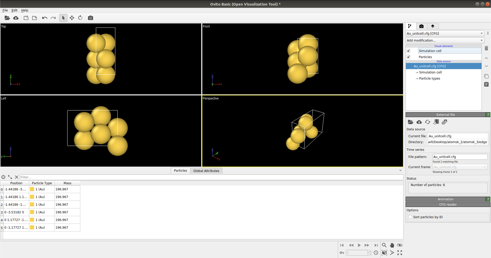
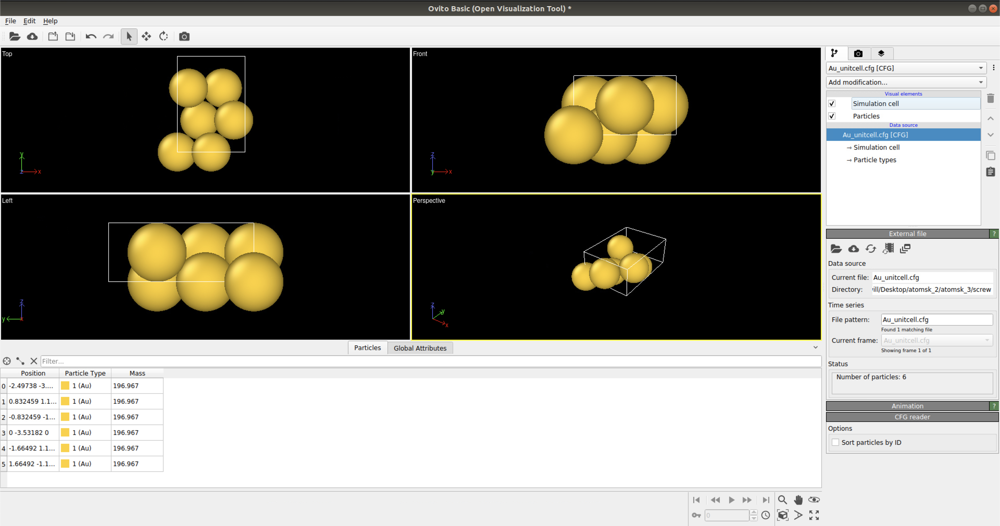
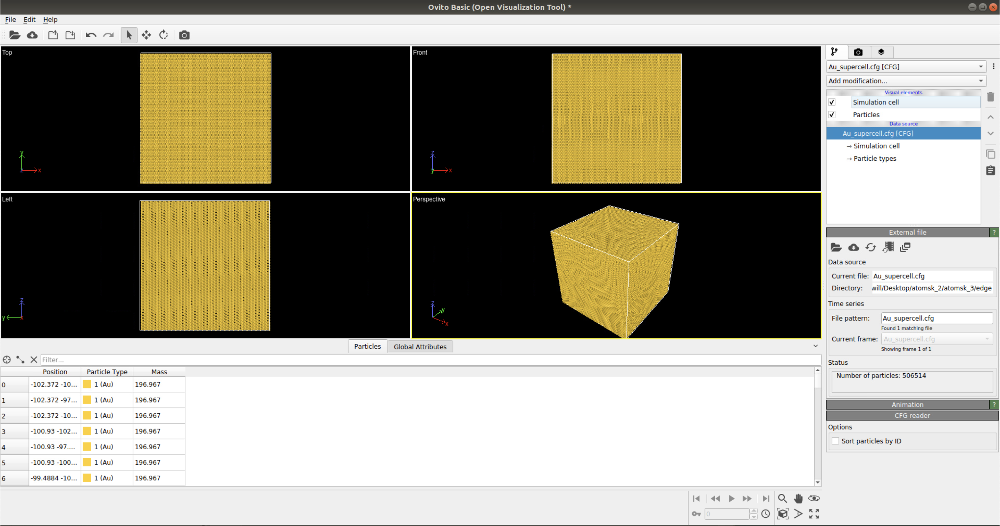
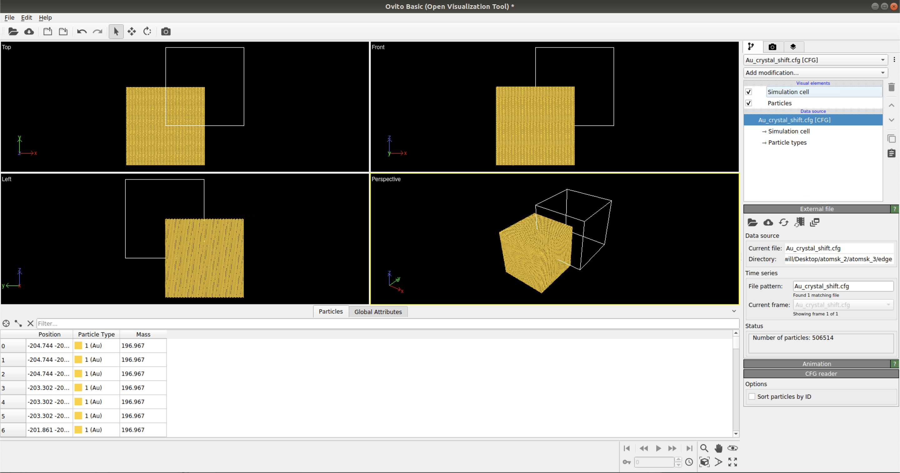
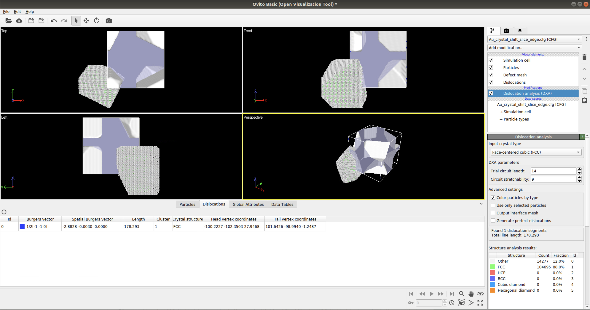
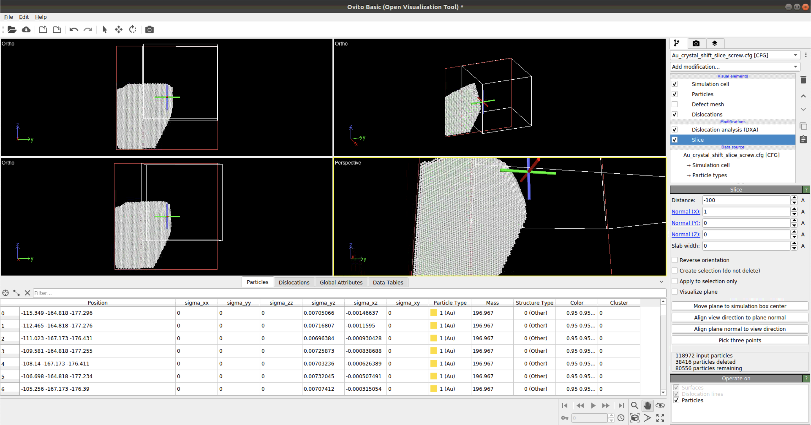
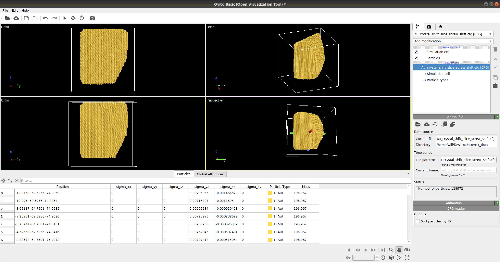
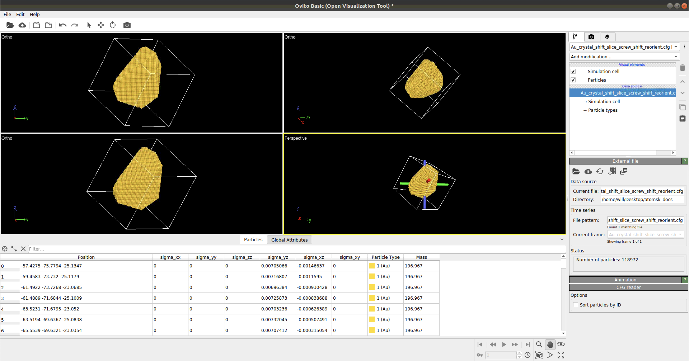

*****************
Crystal Creation
*****************

Goal of Descriptions Below
==========================

This tutorial specifically illustrates the steps to create a Gold (FCC)
nano-particle with an edge/screw defect with a Burger's Vector of [-110].
The crystal is then relaxed using LAMMPS to a lowest energy state. To the
simulate a desired Bragg coherent diffraction pattern we then reorient
the crystal so the crystaollographic axes lie along the coordinate system
of the computational space. PYNX is then used to simulate the (111) reflection.

Step 1: Create oriented unit cell based on desired defect.

Step 2: Expand the unit cell to fill out a volume.

Step 3: Shift the volume to be centered at the origin of the coordinate system

Step 4: Insert a defect.

Step 5: Relax the structure with LAMMPS.

Step 6: Reorient the crystal unit cell edges to lie along coordinate axes.

Step 7: Simulate a Bragg coherent diffraction pattern.

Making Crystal Unit Cell - For Edge Defect
===========================================

This procedure makes a single unit cell to be replicated along a User defined axis.
To be carried out in a terminal. The reason the unit cell is oriented along the specific
axes is to facilitate adding a defect with a given Burger's vector later in this tutorial.
If one is not planning to add a defect to the crystal the orientation can be along the
coordinate axes [100] [010] [001] and the step to reorient the crystal along these axes
at the end can be skipped.

Detailed documentation for the primary tool used here can be found at https://atomsk.univ-lille.fr/tutorial_Al_edge.php .

.. code:: bash

    # To be run in terminal
    atomsk --create fcc 4.0782 Au orient [-110] [11-1] [112] Au_unitcell.cfg

Making Crystal Unit Cell - For Screw Defect
============================================

This procedure makes a single unit cell to be replicated along a User defined axis. To be carried out in a terminal.
Detailed documentation can be found https://atomsk.univ-lille.fr/tutorial_Al_edge.php .

.. warning::

    Not the same command as creating an edge defect

.. code:: bash

    # To be run in terminal
    atomsk --create fcc 4.0782 Au orient [112] [11-1] [-110] Au_unitcell.cfg

Making A Crystal
================

The module used to create a base crystal is found at https://atomsk.univ-lille.fr/tutorial_Al_edge.php . However, this
example is for a 2D metal. Below is an example code on how to create a 3D crystal.

.. code:: python

    from ase.io import read
    import numpy as np

    og_cfg_file = './Au_unitcell.cfg'
    output_file_crystal = './Au_supercell.cfg'

    # Lattice constant for AU
    lattice = 4.078

    # Poisson for Au edge defect
    poisson = '0.42' # gold

    # Supercell size for atomsk
    size_xyz = 204.7156

    # Reading initial Au_unitcell.cfg file
    atom_unit = read(og_cfg_file)
    cell = atom_unit.get_cell()

    rep = size_xyz/np.diagonal(cell)

    rep_final = np.round(rep,0).astype(int)

    cmd = cmd = 'atomsk %s'%og_cfg_file

    # The command used inside a terminal
    cmd += ' -dup %d %d %d'%(rep_final[0],
                             rep_final[1],
                             rep_final[2])
    cmd += f' {output_file_crystal}'

    # cmd_edge_defect = atomsk ./Au_unitcell.cfg -dup 71 29 49 ./Au_supercell.cfg
    # cmd_screw_defect = atomsk ./Au_unitcell.cfg -dup 41 29 71 ./Au_supercell.cfg

    # The output of cmd is then used as a terminal command

Shifting Crystal To Center
==========================

.. code:: python

    output_file_crystal_shift = './Au_crystal_shift.cfg'

    # Initial starting command
    cmd = 'atomsk %s'%output_file_crystal

    # Add in shift
    shift = ['-0.5*box']*3
    cmd += ' -shift %s'%(' '.join(shift))

    # Add in save output
    cmd += f' {output_file_crystal_shift}'

    # cmd_edge_defect = atomsk ./Au_supercell.cfg -shift -0.5*box -0.5*box ./Au_crystal_shift.cfg
    # cmd_screw_defect = atomsk ./Au_supercell.cfg -shift -0.5*box -0.5*box ./Au_crystal_shift.cfg

    # Run cmd in terminal

.. note::

    Documentation on how to use -shift function can be found at https://atomsk.univ-lille.fr/doc.php

Slicing A Crystal
==================

.. note::

    Make sure crystal.py is in your working directory.

.. code:: python

    import crystal

    # The axes of the crystal
    axes = crystal.zone_axes('<100>','<110>','<111>','<210>','<211>','<221>')
    
    # For documentation replication
    np.random.seed(123)
    
    Ncut = np.random.randint(
                            6, # min number of cut per crystal
                            20, # max number of cut per crystal
                            size=1, # number of crystals to make
                            dtype=int)
    
    crystal_idx = 0
    
    # For shape cutting
    depths = size_xyz * 0.5 * np.random.uniform(size=Ncut[crystal_idx],
                                                low=0.0,
                                                high=1.0)**(1./3)
    
    ix = np.random.choice(axes.shape[0], size=Ncut[crystal_idx])
    
    
    # Creating cmd
    
    cmd = 'atomsk %s'%output_file_crystal_shift
    
    # Cut the crystal shape
    for ax, depth in zip(axes[ix], depths):
        cmd += ' -cut above %.2f [%d%d%d]'% (depth, ax[0], ax[1], ax[2])
    
    # Add in save output
    output_file_crystal_shift_slice = './Au_crystal_shift_slice.cfg'
    
    cmd += f' {output_file_crystal_shift_slice}'
    
    cmd

.. note::

    Documentation on how to use -cut function can be found at https://atomsk.univ-lille.fr/doc.php

Placing Edge Defect
===================

.. code:: python

    # Magnitude of deform, shear, and dislocationa
    rands = np.random.normal(loc=0.0, scale=0.01, size=3)
    rands2 = np.random.normal(loc=0.0, scale=0.01, size=3)

    # Lattice constant for Au
    lattice = 4.0782

    rands3 = lattice * 0.5 * 2**0.5
    
    # Poisson for Au edge defect
    poisson = '0.42'
    
    sdmap = ['X','Y','Z']
    
    
    #Burgers Vector = [-110] - defined by Us in this example
    # Edge defect lies along the cartisan Z axis - the glide plane normal to Y
    crystal_starting_orientation = '[-110] [11-1] [112]'
    
    
    cmd = 'atomsk %s'%output_file_crystal_shift_slice
    cmd += ' -dislocation 0.01 0.001 edge2 %s %s %.6f %s'%('Z', 'Y', rands3, poisson)
    
    # Add in save output
    output_file_crystal_shift_slice_edge = './Au_crystal_shift_slice_edge.cfg'
    cmd += f' {output_file_crystal_shift_slice_edge}'

    # Run cmd in terminal

.. note::

    Documentation on how to use -dislocation along with the edge2 function can
    be found at https://atomsk.univ-lille.fr/tutorial_Al_edge.php

Placing Screw Defect
====================

.. code:: python

    sdmap = ['X','Y','Z']
    
    cmd = 'atomsk %s'%output_file_crystal_shift_slice_screw_shift
    
    cmd += ' -dislocation 0.01 0.001 screw %s %s %.6f'%('Z', 'Y', rands3)
    
    # Add in save output
    output_file_crystal_shift_slice_screw = './Au_crystal_shift_slice_screw.cfg'
    cmd += f' {output_file_crystal_shift_slice_screw}'

    
    # Run cmd in terminal

.. note::

    Documentation on how to use -dislocation along with the screw function can
    be found at https://atomsk.univ-lille.fr/tutorial_Al_screw.php

Alignment Of Crystal
====================
This function helps align the defect crystal back to it's original orientation.

.. note::
    One will need to create 'box_size.txt' file and place it inside the working directory.

.. code:: python

    # Create a file called box_size.txt
    # Place this bit of code inside the file
    conventional
    215 215 215
    90.0 90.0 90.0

.. note::
    215 denotes the simulation cell size for the LAMMPS relaxation. This should be larger than the inital SuperCell.cfg size.

.. code:: python

    input_file = './Au_crystal_shift_slice_screw.cfg'
    output_file = './Au_crystal_shift_slice_screw_align.cfg'

    cmd = f'atomsk {input_file} -alignx -properties box_size.txt {output_file}'

    # Run cmd inside your terminal

Shift Screw Crystal Back
========================

.. code:: python

    output_file_crystal_shift_slice_screw_shift = output_file_crystal_shift_slice_screw_align[:-4] + '_shift.cfg'
    
    # Initial starting command
    cmd = 'atomsk %s'%output_file_crystal_shift_slice_screw_align
    
    # Add in shift
    shift = ['0.5*box']*3
    cmd += ' -shift %s'%(' '.join(shift))
    
    # Add in save output
    cmd += f' {output_file_crystal_shift_slice_screw_shift}'

    # Run cmd in terminal

Relaxation of Crystal
======================

To relax the structures created through AtomSK one must use the LAMMPS program. Installation instructions can be
found on the installation page of the Docs.

To run a demonstration of LAMMPS one must first activate the appropriate conda environment.

.. code:: bash

    # Activate the conda env
    source activate lammps_env
    
    # cd to appropriate directory for sample LAMMPS simulation
    cd ./path/to/crystal_simulation_rep/lammps_demo/

    # Edit the in.min_all file

        # define system units, simulation box boundary type, and input data style
        units metal
        boundary f f f
        atom_style atomic
        
        # import lammps data file (simulation box dimension, atom coordinates, atom type)
        read_data lmpdata/${outname}_0.lmp
    
        # define interatomic interactions (force field)
        # in this case, we use the EAM functional form with parameters for gold
        # see https://lammps.sandia.gov/doc/pair_eam.html
        #  note: Au_u3.eam is taken from the lammps source code directory called "potentials"
        pair_style eam
        pair_coeff  * * ff/Au_u3.eam
    
        neighbor 2.0 nsq
        neigh_modify delay 0 every 1 check yes
    
        # define energy minimization criteria and run minimization
        # note: that this is a very short minimization, adjust the values acoordingly
        # see https://lammps.sandia.gov/doc/minimize.html
    
        min_style cg
        minimize 1.0e-6 1.0e-6 1000 1000
    
        # output minimized structure to lammps data file format
        write_data lmpdata/${outname}_1.lmp

    # command to run simulations in terminal
    # the number after -np is how many cpu cores the User would like to use
    mpirun -np 4 lmp_mpi -in in.min_all 

Reset Orientation of Crystal
=============================

To facilitate computation of Bragg coherent diffraction patterns the orientation of the crystal
needs to be known in the coordinate frame of the simulation. The easiest orientation to use is
one where the crystal lattice lies along the coordinate system axes. This command will reorient
the simulated crystal.

.. code:: python

    original_orientation = '[112] [11-1] [-110]'
    desired_reorient = '[100] [010] [001]'

    input_file = './Au_crystal_shift_slice_screw.cfg'
    output_file = './Au_crystal_shift_slice_screw_reorient.cfg'

    cmd = f'atomsk {input_file} -orient {original_orientation} {desired_reorient} {output_file}'

    # Run cmd in a terminal

.. note::

    Documentation on how to use -orient function can be found at https://atomsk.univ-lille.fr/doc.php

Viewing Crystal
================

By using the Ovito Visualization GUI one can view the atomic structure
of the simulated crystal.
