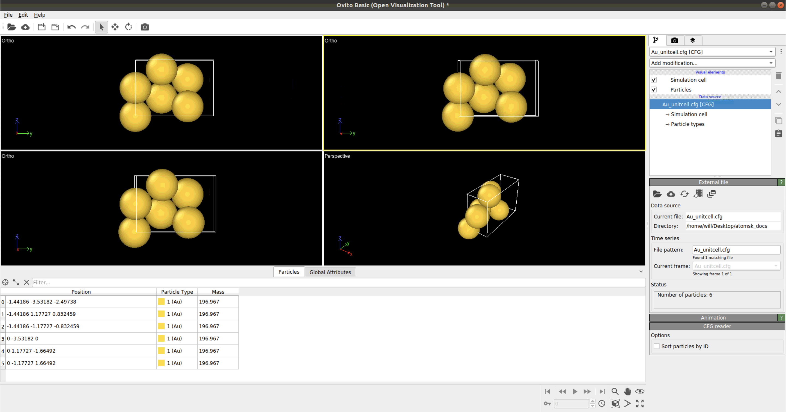
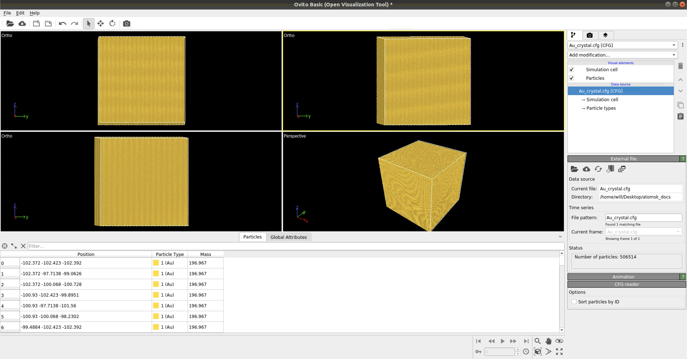
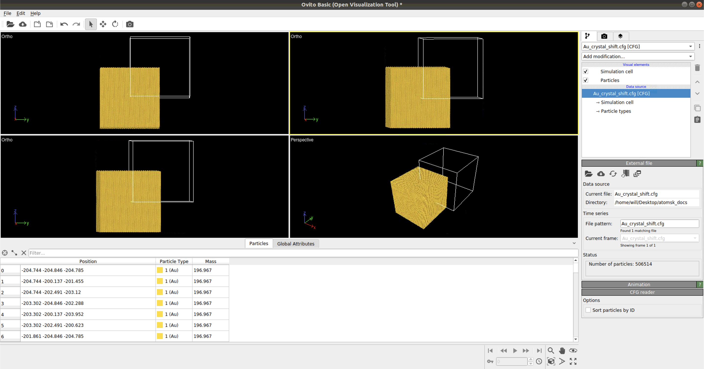

*****************
Crystal Creation
*****************

Goal of Descriptions Below
==========================

To create a Gold nano-particle with an edge/screw defect with a Burger's Vector of [-110]. Relax this simulated crystal
in LAMMPS. Re-orient the crystal so PYNX can simulated the (111) reflection.

Making Crystal Unit Cell
========================

This procedure makes a single unit cell to be replicated along a User defined axis. To be carried out in a terminal.
Better documentation can be found https://atomsk.univ-lille.fr/tutorial_Al_edge.php .

.. code:: bash

    # To be run in terminal
    atomsk --create fcc 4.0782 Au orient [-110] [11-1] [112] Au_unitcell.cfg

Making A Crystal
================

The module used to create a base crystal is found at https://atomsk.univ-lille.fr/tutorial_Al_edge.php . However, this
example is for a 2D metal. Below is an example code on how to create a 3D crystal.

.. code:: python

    pip install ase

.. code:: python

    from ase.io import read

    og_cfg_file = './Au_unitcell.cfg'
    output_file_crystal = './Au_crystal.cfg'

    # Lattice constant for AU
    lattice = 4.078

    # Poisson for Au edge defect
    poisson = '0.42' # gold

    # Supercell size for atomsk
    size_xyz = 204.7156

    # Reading initial Au_unitcell.cfg file
    atom_unit = read(og_cfg_file)
    cell = atom_unit.get_cell()

    rep = size_xyz/np.diagonal(cell)

    rep_final = np.round(rep,0).astype(int)

    cmd = cmd = 'atomsk %s'%og_cfg_file

    # The command used inside a terminal
    cmd += ' -dup %d %d %d'%(rep_final[0],
                             rep_final[1],
                             rep_final[2])
    cmd += f' {output_file_crystal}'

    # The output of cmd is then used as a terminal command

Shifting Crystal To Center
==========================

.. code:: python

    output_file_crystal_shift = './Au_crystal_shift.cfg'

    # Initial starting command
    cmd = 'atomsk %s'%output_file_crystal

    # Add in shift
    shift = ['-0.5*box']*3
    cmd += ' -shift %s'%(' '.join(shift))

    # Add in save output
    cmd += f' {output_file_crystal_shift}'

    # Run cmd in terminal

.. note::

    Documentation on how to use -shift function can be found at https://atomsk.univ-lille.fr/doc.php

Slicing A Crystal
==================

.. code:: python

    # No idea what hycpy is
    from hycpy import crystal

    axes = crystal.zone_axes('<100>','<110>','<111>','<210>','<211>','<221>')

    Ncut = np.random.randint(
                            6, # min number of cut per crystal
                            20, # max number of cut per crystal
                            size=1, # number of crystals to make
                            dtype=int)

    crystal_idx = 0

    # For shape cutting
    depths = size_xyz * 0.5 * np.random.uniform(size=Ncut[crystal_idx],
                                                low=0.0,
                                                high=1.0)**(1./3)

    ix = np.random.choice(axes.shape[0], size=Ncut[crystal_idx])

    # Creating cmd

    cmd = 'atomsk %s'%output_file_crystal_shift

    # Cut the crystal shape
    for ax, depth in zip(axes[ix], depths):
        cmd += ' -cut above %.2f [%d%d%d]'% (depth, ax[0], ax[1], ax[2])

    # Add in save output
    output_file_crystal_shift_slice = './Au_crystal_shift_slice.cfg'
    cmd += f' {output_file_crystal_shift_slice}'

    # Run cmd's in terminal

.. note::

    Documentation on how to use -cut function can be found at https://atomsk.univ-lille.fr/doc.php

Placing Edge Defect
===================

.. code:: python

    # Magnitude of deform, shear, and dislocation
    rands = np.random.normal(loc=0.0, scale=0.01, size=3)
    rands2 = np.random.normal(loc=0.0, scale=0.01, size=3)

    #Random.uniform(1.1, 5)
    rands3 = lattice * 0.5 * 2**0.5

    # Poisson for Au edge defect
    poisson = '0.42'

    sdmap = ['X','Y','Z']

    cmd = 'atomsk %s'%output_file_crystal_shift
    cmd += ' -dislocation 0.0 0.0 edge2 %s %s %.6f %s'%(sdmap[v211], sdmap[v111], rands3, poisson)

    # Add in save output
    output_file_crystal_shift_slice_edge = './Au_crystal_shift_slice_edge.cfg'
    cmd += f' {output_file_crystal_shift_slice_edge}'

    # Run cmd in terminal

.. note::

    Documentation on how to use -dislocation along with the edge2 function can
    be found at https://atomsk.univ-lille.fr/tutorial_Al_edge.php

Placing Screw Defect
====================

.. code:: python

    sdmap = ['X','Y','Z']

    cmd = 'atomsk %s'%output_file_crystal_shift

    cmd += ' -dislocation 0.0 0.0 screw %s %s %.6f'%(sdmap[v110], sdmap[v111], rands3)

    # Add in save output
    output_file_crystal_shift_slice_screw = './Au_crystal_shift_slice_screw.cfg'
    cmd += f' {output_file_crystal_shift_slice_screw}'

    # Run cmd in terminal

.. note::

    Documentation on how to use -dislocation along with the screw function can
    be found at https://atomsk.univ-lille.fr/tutorial_Al_screw.php

Relaxation of Crystal
======================

Coming Soon...

Reset Orientation of Crystal
=============================

This will be used to reorient the crystal. This is needed to view the (111) refletion in pynx.

.. code:: python

    original_orientation = '[-110] [11-1] [112]'
    desired_reorient = '[100] [010] [001]'

    input_file = './Au_crystal_shift_slice_screw.cfg'
    output_file = './Au_crystal_shift_slice_screw_reorient.cfg'

    cmd = f'atomsk {input_file} -orient {original_orientation} {desired_reorient} {output_file}'

    # Run cmd in a terminal

.. note::

    Documentation on how to use -orient function can be found at https://atomsk.univ-lille.fr/doc.php

Viewing Crystal
================

By using Ovito Visualization GUI one can view all the of the crystal they made in a relatively easy fashion.
